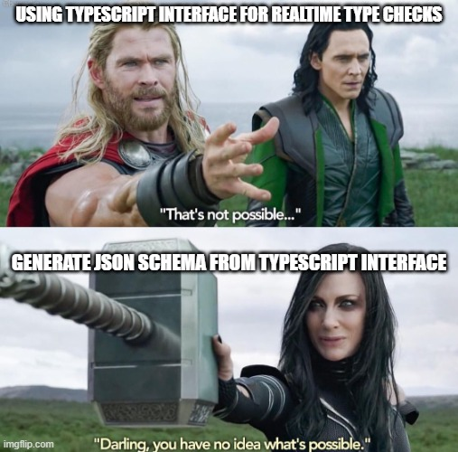

### Prerequisites

Read the [previous article](/006-getting-started-with-rest) about type-safe REST APIs, if you haven't yet. It will give a huge boost on productivity. Seriously... go go go...
So, glad you've back. Now let's get down to business...

### Some sad facts about Typescript interfaces - and a possible solution

Let's face it - you have a well-defined REST API in a Typescript interface but you cannot use Typescript interfaces realtime as they _does not exists realtime_ 😿
But there's a solution that can be easily adopted - JSON Schemas



So the plan is:
1. Design the API
1. Create a JSON Schema from the API definitions
1. Wire some validation logic on the Backend

### Generating the Schema
FuryStack offers some help when it comes to defining / designing the API interface - as mentioned in the last article. There is a nice tool that will help us create the JSON Schema - [ts-json-schema-generator](https://github.com/vega/ts-json-schema-generator)
So if we have an interface ready, we can generate the JSON schema with a simple command from an NPM script: 
```sh
yarn ts-json-schema-generator -f tsconfig.json --no-type-check -p common/src/path/to/my/api.schema.ts -o common/src/path/to/my/api.schema.json
```

Once it is done, you can access / re-export it in your `common` package - maybe you have to enable `resolveJsonModule` in your tsconfig.

```ts
import * as mySchema from './path/to/my/api.schema.json'
export { mySchema }
```


### Validation in the Service

Once you will be able to import your schema, you can simply use the `Validate()` method in REST Api. Let's take for example the endpoint from the previous post.

```ts
import { mySchema } from 'common'
import { Validate } from '@fuystack/rest-service'

const customHeadersEndpoint: RequestAction<CustomHeaders> = Validate({
    schema: mySchema
    schemaName: 'CustomHeaders'
})(async ({ headers }) => {
  console.log(headers)
  return JsonResult(headers)
})
```

### The Gotchas

 - All input data (query, headers, url, body) will be validated - **in depth**
 - You can define nested types, string literals, optional parameters, type intersections, nearly everything that Typescript can offer. You can throw errors on additional parameters as well.
 - You will automatically get nice 400 responses with detailed error messages if you miss something
 - Schema can be re-generated as your API changes